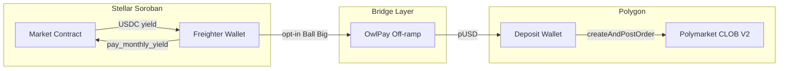

# Ball Big — Polymarket Integration Guide

YieldStream **Ball Big** is a playful fork for **dust-sized monthly yield**: users can claim pennies safely on Stellar, or (when live) route that micro-yield into **high-stakes Polymarket** prediction markets.

> **Status:** Phase 0 — Coming Soon UI only. This document describes how to ship Phases 1–4.

---

## 1. Vision

### The problem

Model A pays monthly yield upfront. On a 100 USDC lock at 8% APY, each payout is roughly **0.6 USDC** (~₹50 at illustrative rates). For many users that's spare change — not worth a separate mental transaction.

### The fork

| Path | User mindset | On-chain today | Future |
|------|--------------|----------------|--------|
| **Claim safe** | "I'll take my pennies" | `pay_monthly_yield` on Soroban | Same |
| **Ball big** | "Who needs pennies anyway — swing for 10x" | Coming Soon UI | Stellar dust → Polygon pUSD → Polymarket CLOB |

### INR storytelling vs USDC reality

The UI shows illustrative **₹5 → ₹50** conversions using a static `USDC_TO_INR = 85` constant in `apps/web/src/lib/ballBig.ts`. On-chain amounts are always **USDC (7 decimals)**. Never imply guaranteed FX or guaranteed 10x returns.

---

## 2. User flow

```
1. User has claimable dust yield (monthlyDue > 0, can_pay_monthly_yield = true)
2. Dashboard shows Ball Big nudge when isDustYield(monthlyDue)
3. User opens /treasury/ball-big
4. Choice:
   a) Claim safe → payMonthlyYield() (Freighter signs Soroban tx)
   b) Ball big → consent modal → server proxy places Polymarket order (Phase 2+)
5. Position tracked; settlement credited or lost
6. Optional: re-deposit winnings to SY vault
```

### Consent requirements (Phase 2+)

Before the first Ball Big bet, collect explicit acknowledgment:

- Total loss is possible (prediction markets, not savings)
- Not financial advice; illustrative 10x is not a promise
- Polymarket geo-restrictions and eligibility apply
- Cross-chain bridge latency and fees may apply

Store consent timestamp server-side keyed to Stellar address.

---

## 3. Dust threshold

**UI constant** (`lib/ballBig.ts`):

```typescript
export const DUST_YIELD_THRESHOLD = 5_000_000n; // 0.5 USDC at 7 decimals

export function isDustYield(amount: bigint): boolean {
  return amount > 0n && amount < DUST_YIELD_THRESHOLD;
}
```

**Server validation** (Phase 2+): re-read `claimable_yield` from the market contract before executing a Ball Big flow. Reject if amount is zero or exceeds `BALL_BIG_DUST_THRESHOLD_USDC` env (default `0.5`).

Configurable env:

```bash
BALL_BIG_DUST_THRESHOLD_USDC=0.5
BALL_BIG_MAX_BET_USDC=0.5
```

---

## 4. Cross-chain architecture

Stellar Soroban and Polymarket CLOB V2 run on **different chains** with **different collateral**:

| Layer | Chain | Asset | Role |
|-------|-------|-------|------|
| YieldStream | Stellar (Soroban) | USDC | Monthly yield payouts |
| Bridge | Off-ramp (OwlPay planned) | USDC → fiat/crypto | Move value off Stellar |
| Polymarket | Polygon (137) | pUSD (CLOB V2) | Prediction market collateral |



### Phase 3 bridge options

1. **OwlPay anchor** (README ecosystem milestone) — Stellar USDC off-ramp to bank/crypto
2. **Treasury hot wallet** — protocol claims dust on behalf of user, bridges via CEX/API (higher trust, faster MVP)
3. **User self-bridge** — user claims to wallet, bridges manually (simplest Phase 2 dev test)

For testnet MVP (Phase 2), fund a dev Polygon wallet with pUSD directly — skip Stellar bridge.

---

## 5. Polymarket CLOB V2 setup

> **Important:** Production uses **CLOB V2** only. Legacy `@polymarket/clob-client` (V1) no longer works against `https://clob.polymarket.com`.

### Package

```bash
npm install @polymarket/clob-client-v2 ethers
```

Docs: https://docs.polymarket.com/v2-migration

### Constants

```typescript
const CLOB_HOST = process.env.POLYMARKET_CLOB_HOST ?? "https://clob.polymarket.com";
const CHAIN_ID = Number(process.env.POLYMARKET_CHAIN_ID ?? "137"); // Polygon mainnet
```

### Authentication (two levels)

| Level | Method | Purpose |
|-------|--------|---------|
| L1 | EIP-712 signature (private key) | Create or derive API credentials |
| L2 | HMAC-SHA256 (API key + secret + passphrase) | Place/cancel orders, query trades |

**Never expose L1/L2 credentials to the browser.** All signing happens in a server-side proxy.

### Client initialization (TypeScript)

```typescript
import { ClobClient, Side, OrderType } from "@polymarket/clob-client-v2";
import { Wallet } from "ethers";

const signer = new Wallet(process.env.POLY_PRIVATE_KEY!);

// Step 1: derive API creds (L1)
const bootstrap = new ClobClient({ host: CLOB_HOST, chain: CHAIN_ID, signer });
const creds = await bootstrap.createOrDeriveApiKey();

// Step 2: authenticated client (L2)
// signatureType 3 = POLY_1271 deposit wallet (recommended for new API integrations)
const client = new ClobClient({
  host: CLOB_HOST,
  chain: CHAIN_ID,
  signer,
  creds,
  signatureType: 3,
  funder: process.env.POLY_FUNDER_ADDRESS, // deposit wallet address
});
```

### Signature types

| Type | Wallet | When to use |
|------|--------|-------------|
| 0 | Standalone EOA | MetaMask, raw private key |
| 1 | POLY_PROXY | Email/Magic login users |
| 2 | GNOSIS_SAFE | Safe multisig |
| 3 | POLY_1271 | **Deposit wallet** — recommended for new API users |

See: https://docs.polymarket.com/trading/overview

### Collateral (pUSD)

CLOB V2 uses **pUSD** (Polymarket USD), not legacy USDC.e. Before trading:

1. Fund deposit wallet with pUSD
2. Approve Exchange contract to spend pUSD (via relayer for deposit wallets)
3. Sync balance if needed

See: https://docs.polymarket.com/trading/quickstart

---

## 6. Market discovery

Use the **Gamma Markets API** to discover markets and extract trading metadata:

```
GET https://gamma-api.polymarket.com/markets?active=true&closed=false
```

Per market, you need:

| Field | Use |
|-------|-----|
| `clobTokenIds` | `tokenID` for order placement |
| `tickSize` | Price granularity (`"0.01"`, `"0.001"`, etc.) |
| `negRisk` | EIP-712 domain / exchange contract selection |
| `volume`, `endDate` | "High stakes" curation filter |

### High-stakes curation (Ball Big filter)

Suggested heuristics for the Ball Big market picker:

- Binary outcomes only (Yes/No)
- `volume > $500k` or top-N by 24h volume
- Resolves within 90 days (short-dated = higher drama)
- Exclude markets with `restricted: true` if user geo unknown

Phase 1: replace `MOCK_HIGH_STAKES_MARKETS` in `lib/ballBig.ts` with live Gamma API data via `GET /api/ball-big/markets` (read-only, no auth).

---

## 7. Order placement

For dust bets, prefer **market orders** with **FOK** (fill-or-kill) so the entire micro-stake executes immediately or fails.

```typescript
import { Side, OrderType } from "@polymarket/clob-client-v2";

const orderBook = await client.getOrderBook(tokenID);

const response = await client.createAndPostMarketOrder(
  {
    tokenID,
    amount: dustUsdcAmount, // dollar amount to spend
    side: Side.BUY,
  },
  {
    tickSize: orderBook.tick_size,
    negRisk: orderBook.neg_risk,
  },
  OrderType.FOK,
);

console.log(response.orderID);
```

### Limit orders (alternative)

For specific price targets:

```typescript
const response = await client.createAndPostOrder(
  {
    tokenID,
    price: 0.15,
    size: dustShares,
    side: Side.BUY,
  },
  { tickSize: "0.01", negRisk: false },
  OrderType.GTC,
);
```

### V2 order field changes

V1 fields `nonce`, `feeRateBps`, `taker` are **removed**. V2 adds `timestamp` (ms), `metadata`, `builder`. Fees are set by the operator at match time — do not embed fees in signed orders.

---

## 8. Backend service

Create a server-side proxy. **Private keys must never ship to the client.**

### Recommended structure

```
yieldstream/
├── apps/web/src/app/api/ball-big/
│   ├── markets/route.ts      # Phase 1: Gamma proxy (read-only)
│   ├── quote/route.ts        # Phase 2: preview bet + max loss
│   └── bet/route.ts          # Phase 2: execute Ball Big flow
└── services/polymarket-proxy/  # Optional standalone service
    └── src/index.ts
```

### `POST /api/ball-big/quote`

**Request:**

```json
{
  "stellarAddress": "G...",
  "marketId": "fed-q3",
  "side": "YES",
  "amountUsdc": "0.06"
}
```

**Response:**

```json
{
  "market": { "question": "...", "yesPrice": 0.42 },
  "stakeUsdc": "0.06",
  "maxPayoutUsdc": "0.14",
  "maxLossUsdc": "0.06",
  "feesEstimate": "0.00",
  "disclaimer": "Total loss possible. Not financial advice."
}
```

### `POST /api/ball-big/bet`

**Request:**

```json
{
  "stellarAddress": "G...",
  "marketId": "fed-q3",
  "side": "YES",
  "consentVersion": "1.0"
}
```

**Server steps:**

1. Verify user consent on file
2. Read `claimable_yield` from Soroban market contract — must be dust and `can_pay_monthly_yield`
3. (Phase 4) Trigger `pay_monthly_yield` or treasury-assisted claim
4. Convert USDC → pUSD (bridge or treasury float)
5. Place Polymarket market order via CLOB client
6. Persist bet record: `{ stellarAddress, orderId, tokenId, stake, timestamp, status }`
7. Return `{ orderId, status: "submitted" }`

### Idempotency

Use `Idempotency-Key` header (Stellar address + monthly payout ledger) to prevent double-bets on retry.

---

## 9. Position tracking

### Open orders

```typescript
const openOrders = await client.getOpenOrders();
```

### Trades / fills

Poll CLOB trade history or subscribe to WebSocket streams (see Polymarket docs).

### Settlement

When market resolves:

- Winning positions: redeem via Polymarket redemption flow
- Optional: bridge pUSD winnings back to Stellar USDC and offer one-click re-deposit to SY vault

### Cron / keeper extension

Extend `services/keeper` or add `services/ball-big-settler`:

```
every 15 min:
  - poll open Ball Big bets
  - update status (filled / cancelled / resolved)
  - notify user via in-app Activity log (DevLogPanel pattern)
```

---

## 10. Security & compliance

| Risk | Mitigation |
|------|------------|
| Private key leak | Server-only signing; rotate keys; use deposit wallet with limited float |
| Double-spend dust | Idempotency keys; re-read on-chain `claimable_yield` before bet |
| Geo-restrictions | Polymarket blocks certain jurisdictions; gate UI + server by IP/geo |
| KYC | Polymarket account requirements apply to trading wallets |
| Total loss | Prominent disclaimer; no guaranteed multiplier copy in live trading UI |
| Bridge trust | Document custody model if treasury hot wallet bridges on user's behalf |

### Env vars (never commit)

```bash
# Polymarket CLOB V2
POLYMARKET_CLOB_HOST=https://clob.polymarket.com
POLYMARKET_CHAIN_ID=137
POLY_PRIVATE_KEY=0x...
POLY_API_KEY=...
POLY_API_SECRET=...
POLY_PASSPHRASE=...
POLY_FUNDER_ADDRESS=0x...        # deposit wallet
POLY_SIGNATURE_TYPE=3

# Ball Big limits
BALL_BIG_DUST_THRESHOLD_USDC=0.5
BALL_BIG_MAX_BET_USDC=0.5
BALL_BIG_ENABLED=false           # feature flag

# Bridge (Phase 3)
OWLPAY_API_KEY=...
```

---

## 11. Phased rollout

| Phase | Scope | Deliverables |
|-------|-------|--------------|
| **0** (current) | Coming Soon UI + this doc | `/treasury/ball-big`, landing section, mock markets |
| **1** | Read-only markets | `GET /api/ball-big/markets` → Gamma API; live cards, no trades |
| **2** | Dev trading | Polymarket proxy; fund dev wallet with pUSD; manual Stellar claim |
| **3** | Bridge | OwlPay off-ramp Stellar USDC → Polygon pUSD |
| **4** | One-click Ball Big | Claim + bridge + bet in single user flow from dust yield |

### Phase 1 checklist

- [ ] Add `@polymarket/clob-client-v2` to `apps/web` or `services/polymarket-proxy`
- [ ] Create `api/ball-big/markets/route.ts` proxying Gamma API
- [ ] Replace `MOCK_HIGH_STAKES_MARKETS` with live data in `StakesMarketGrid`
- [ ] Keep trade buttons disabled until Phase 2

### Phase 2 checklist

- [ ] Create deposit wallet; fund with pUSD; set approvals
- [ ] Implement `createOrDeriveApiKey()` in server bootstrap script
- [ ] `POST /api/ball-big/quote` and `POST /api/ball-big/bet`
- [ ] Consent modal + server-side consent store
- [ ] Activity log entries for bets

### Phase 4 checklist

- [ ] Soroban read + claim orchestration in bet handler
- [ ] Bridge integration (OwlPay or treasury float)
- [ ] Enable `BALL_BIG_ENABLED=true`
- [ ] Remove Coming Soon badges from trade CTAs

---

## 12. File reference (Phase 0)

| File | Purpose |
|------|---------|
| `apps/web/src/lib/ballBig.ts` | Dust threshold, INR helpers, mock markets |
| `apps/web/src/components/ball-big/*` | Ball Big UI components |
| `apps/web/src/app/treasury/ball-big/page.tsx` | Treasury Ball Big page |
| `apps/web/src/components/landing/BallBigSection.tsx` | Landing page section |
| `apps/web/src/components/app/ui.tsx` | `ComingSoonBadge`, `ChoiceCard` |

---

## Further reading

- Polymarket docs index: https://docs.polymarket.com/llms.txt
- CLOB V2 migration: https://docs.polymarket.com/v2-migration
- Trading quickstart: https://docs.polymarket.com/trading/quickstart
- Gamma Markets API: https://docs.polymarket.com/developers/gamma-markets-api/get-markets
- YieldStream README: `../README.md` (OwlPay off-ramp milestone)
